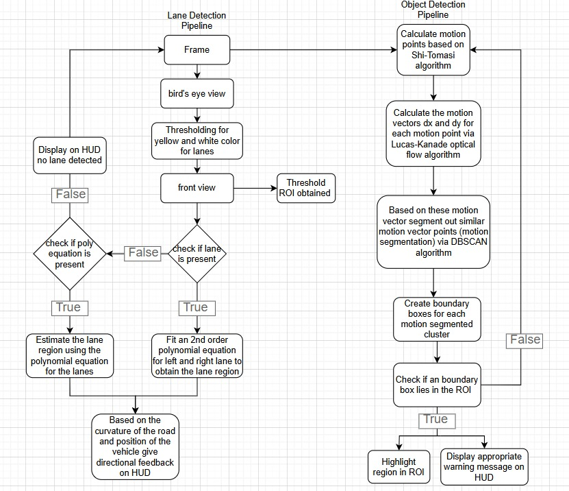

# 🛣️ Autonomous Vehicle: Lane Detection, Object Detection & Directional Control

An end-to-end classical computer vision-based autonomous driving system that performs **lane detection**, **dynamic object detection**, and **HUD-based directional feedback** using motion and color segmentation all in real time.

---

## 📑 Table of Contents

- [🔍 Project Overview](#-project-overview)
- [📊 System Architecture](#-system-architecture)
- [🧠 Algorithms Used](#-algorithms-used)
- [🚗 Pipeline Breakdown](#-pipeline-breakdown)
  - [Lane Detection](#lane-detection)
  - [Object Detection](#object-detection)
  - [Directional Control](#directional-control)

---

## 🔍 Project Overview

This project simulates the behavior of an autonomous vehicle in off-road or controlled environments by integrating three key components:

- **Lane Detection** using bird's eye view transformations and color thresholding.
- **Object Detection** through motion vector tracking and clustering.
- **HUD-based Directional Control** for real-time driver assistance based on road curvature and detected obstacles.

---

## 📊 System Architecture

The system follows a dual-pipeline architecture:

- **Left pipeline** for lane detection and feedback generation.
- **Right pipeline** for motion-based object detection and ROI analysis.

Both systems communicate with a central display system (HUD) to render directional cues and safety warnings.

---

## 🧠 Algorithms Used

| Component         | Algorithm(s) Used                                                   |
|------------------|----------------------------------------------------------------------|
| Lane Detection    | Perspective Transform, Thresholding, Polynomial Regression (2nd order) |
| Object Detection  | Shi-Tomasi Corner Detection, Lucas-Kanade Optical Flow, DBSCAN       |
| Control Logic     | Curvature Estimation, ROI Intersection Checks                        |

---

## 🚗 Pipeline Breakdown

### Lane Detection

- Convert incoming frame to bird's eye view.
- Apply color thresholding to isolate white and yellow lane lines.
- Reproject to front view and check for lane presence.
- If lanes are detected, fit a 2nd order polynomial and estimate lane curvature.
- Display directional feedback on HUD based on curvature and lane alignment.

### Object Detection

- Detect motion points using **Shi-Tomasi**.
- Track motion vectors using **Lucas-Kanade Optical Flow**.
- Apply **DBSCAN clustering** to group similar motion patterns.
- Generate boundary boxes and highlight any within the region of interest (ROI).
- Display safety warnings on HUD if ROI contains dynamic objects.

### Directional Control

- If lanes are detected: provide curvature-based directional arrows.
- If objects in ROI: overlay real-time warnings for safe navigation.

